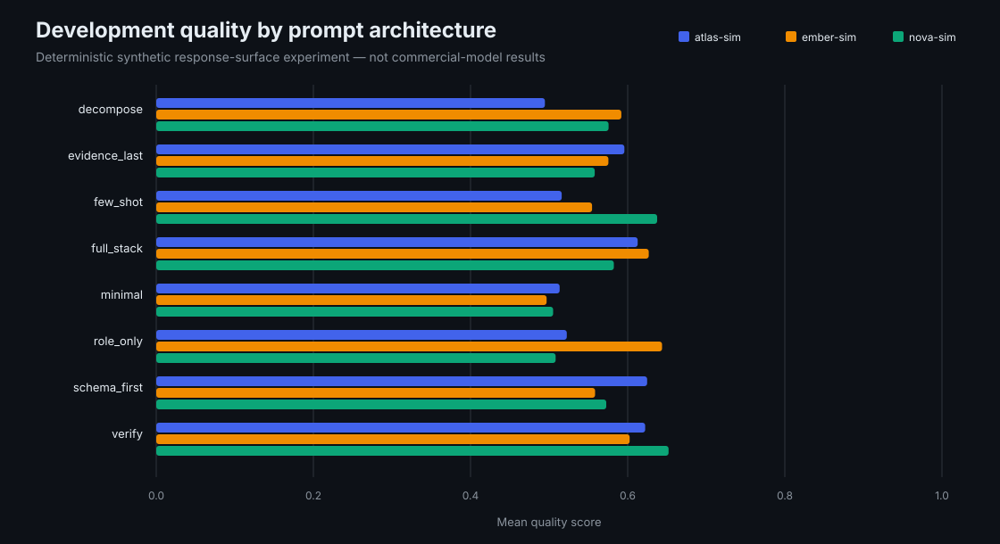
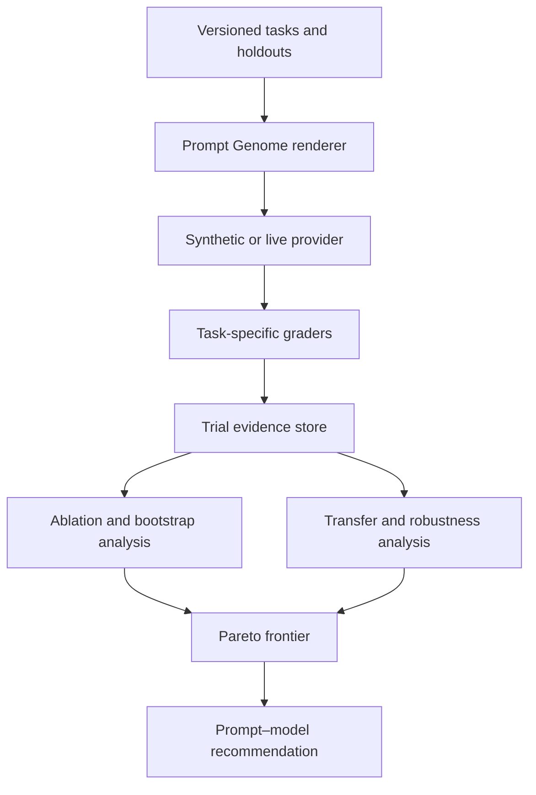

# Prompt Optimisation Lab

### A reproducible research platform for prompt architecture, cross-model transfer and quality–cost–latency optimisation

[](https://github.com/Ali-Mattar-code/prompt-optimisation-lab/actions/workflows/ci.yml)
[](https://www.python.org/)
[](LICENSE)
[](docs/methodology.md)

Prompt Optimisation Lab treats prompting as experimental science rather than a collection of magic phrases. It decomposes a prompt into testable components, evaluates complete prompt architectures across tasks and model profiles, measures uncertainty, tests transfer to unseen tasks, and exposes the trade-off between quality, latency and token cost.

The central question is not *“What is the greatest prompt?”* It is:

> **Which prompt–model configuration performs best for this task, under this evidence set, budget and reliability requirement—and does the result survive a holdout test?**



> [!IMPORTANT]
> The committed results use a deterministic **synthetic response surface**. They prove that the experimental, grading and optimisation machinery is reproducible; they are not benchmark results for OpenAI, Anthropic or Google models. Official live-provider adapters are included so independently generated results can be added with explicit evidence.

## Demonstration at a glance

| Dimension | Committed experiment |
|---|---:|
| Core factorial trials | **4,032** |
| Robustness stress trials | **1,728** |
| Tasks | **24** |
| Prompt architectures | **8** |
| Synthetic model profiles | **3** |
| Repetitions per core cell | **7** |
| Development / untouched holdout split | **16 / 8 tasks** |
| Bootstrap resamples per comparison | **1,000** |

The three synthetic profiles select three different development winners:

| Synthetic profile | Winning architecture | Mean quality | Pass rate | Mean prompt tokens | Winner stability |
|---|---|---:|---:|---:|---:|
| `atlas-sim` | `schema_first` | 0.625 | 56.2% | 47.2 | **30.3%** |
| `nova-sim` | `verify` | 0.652 | 60.7% | 64.9 | **57.2%** |
| `ember-sim` | `role_only` | 0.644 | 61.6% | 42.9 | **49.3%** |

Winner stability is the share of 1,000 paired task-cluster bootstrap resamples that select the same development winner. The modest values are useful negative evidence: a narrow point-estimate lead should not be mistaken for a universal recommendation. This is an intentionally constructed research landscape, not a claim that a real provider prefers any specific variant.

## Why this is professional prompt engineering

Serious prompt engineering starts with measurable success criteria. OpenAI recommends pinning model snapshots and maintaining eval suites because prompt behaviour can change across versions. Anthropic advises defining success criteria and empirical tests before optimisation. Google describes prompt design as iterative experimentation and notes that both too few and too many examples can reduce effectiveness.

This project operationalises those principles:

- prompts are versioned data structures, not anonymous text files;
- development and holdout tasks are separated;
- prompt components are ablated rather than credited by intuition;
- repeated trials expose stochastic variance;
- quality improvements receive confidence intervals;
- a prompt tuned on one model is tested on the others;
- cost and latency are optimisation objectives, not afterthoughts;
- failed experiments remain visible.

## Prompt Genome

Every architecture is built from the same inspectable genome:

| Component | Experimental question |
|---|---|
| Role instruction | Does a task-specific identity improve instruction following? |
| Delimiters | Does explicit separation of evidence, task and examples help? |
| Few-shot examples | Do demonstrations improve the task or induce example overfitting? |
| Output contract | Does a schema increase deterministic downstream validity? |
| Decomposition | Does breaking the task down improve reasoning enough to justify extra tokens? |
| Verification | Does a final constraint check reduce errors? |
| Evidence position | Is evidence more effective before or after the instruction? |

The committed library includes `minimal`, `role_only`, `schema_first`, `few_shot`, `decompose`, `verify`, `evidence_last`, and `full_stack`. New variants can be generated by single-component mutation.

## Experimental system



## Implemented research instruments

### 1. Controlled prompt ablation

Difference-in-means estimates and standard errors quantify how each prompt component changes quality across the committed design. The output includes 95% intervals and sample counts rather than simply declaring that a technique “works.”

### 2. Paired bootstrap comparisons

Each architecture is compared with the minimal baseline on the same model, task and repetition cells. The paired design removes some between-task noise; 1,000 deterministic bootstrap resamples estimate uncertainty.

### 3. Development-winner stability

Complete development tasks are resampled as clusters, retaining all variants and repetitions within each draw. Selection frequency reveals when the apparent winner is sensitive to task-suite composition—even when its point estimate ranks first.

### 4. Cross-model transfer matrix

The best development prompt from each source profile is frozen and evaluated on every target profile's holdout tasks. Transfer regret measures the distance from the target profile's holdout oracle.

### 5. Successive-halving optimiser

Weak variants are eliminated using small task budgets before increasingly large budgets are allocated to survivors. The full elimination trace is preserved, including early choices that later appear suboptimal.

### 6. Quality–cost–latency Pareto frontier

A configuration enters the frontier only when no same-model configuration is simultaneously higher quality, shorter and faster. This prevents a very large prompt from winning solely through a small quality improvement.

### 7. Robustness laboratory

Untouched holdout tasks are transformed with three deterministic stressors:

- controlled typographical noise;
- irrelevant evidence distractors;
- changed instruction ordering.

Quality retention is reported by model and architecture.

### 8. Live multi-provider execution

Adapters are implemented for:

- OpenAI Responses API;
- Anthropic Messages API;
- Google Gemini API.

Live execution is always explicit, writes to an ignored evidence directory by default, and never stores API keys in result files.

## Quick start

```bash
git clone https://github.com/Ali-Mattar-code/prompt-optimisation-lab.git
cd prompt-optimisation-lab
python -m venv .venv
source .venv/bin/activate  # Windows: .venv\Scripts\activate
python -m pip install -e ".[dev]"
python scripts/run_research_demo.py
pytest
```

Expected output:

```text
trials=4032 models=3 variants=8 winners=schema_first,verify,role_only
```

The deterministic demonstration requires no API keys and makes no network calls.

## Inspect the prompts

List all prompt genomes:

```bash
promptlab variants
```

Render one complete prompt:

```bash
promptlab render ext-005 --variant schema_first
```

The renderer adapts the same genome to classification, JSON extraction, grounded reasoning and constrained-writing tasks.

## Run a real model

Install only the provider you intend to use:

```bash
python -m pip install -e ".[openai]"
export OPENAI_API_KEY="..."
promptlab run-live \
  --provider openai \
  --model YOUR_PINNED_MODEL_SNAPSHOT \
  --variant schema_first \
  --repetitions 3
```

Use `anthropic` or `gemini` with their corresponding package extra and environment variable. Model identifiers are intentionally supplied at runtime so the repository does not silently claim that a moving alias is a stable experiment.

Before publishing a live comparison:

1. Pin exact model versions where the provider supports it.
2. Freeze the task-suite commit.
3. Use identical tasks, repetition counts and decoding settings.
4. Record failures as well as successes.
5. Review provider terms and data-retention requirements.
6. Add current provider pricing separately; adapters do not guess changing list prices.
7. Label results with their actual execution date and region.

## Dashboard

```bash
python -m pip install -e ".[dashboard]"
streamlit run dashboard/app.py
```

The dashboard contains:

- experiment scale and winning architectures;
- component-effect estimates with uncertainty;
- the quality–prompt-length frontier;
- a cross-model transfer-regret heatmap;
- robustness-retention distributions;
- the explicit evidence boundary.

## Evidence files

| Artifact | Contents |
|---|---|
| [`summary.json`](artifacts/demo/summary.json) | Scale, winners, bootstrap intervals and optimisation trace |
| [`component_effects.csv`](artifacts/demo/component_effects.csv) | Component effects, standard errors and 95% intervals |
| [`cross_model_transfer.csv`](artifacts/demo/cross_model_transfer.csv) | Source–target prompt transfer and regret |
| [`pareto_frontier.csv`](artifacts/demo/pareto_frontier.csv) | Non-dominated quality, prompt-length and latency configurations |
| [`robustness_retention.csv`](artifacts/demo/robustness_retention.csv) | Clean versus stressed holdout performance |
| [`selection_stability.csv`](artifacts/demo/selection_stability.csv) | Task-cluster bootstrap selection frequency for every model–variant pair |
| [`report.md`](artifacts/demo/report.md) | Human-readable generated research report |

## Repository map

```text
src/promptlab/          prompt genomes, providers, graders and experiment analysis
datasets/               development and untouched holdout tasks
configs/                deterministic and live experiment templates
scripts/                reproducible research entry point
dashboard/              interactive experiment explorer
artifacts/demo/          committed machine- and human-readable evidence
tests/                   unit, statistical and end-to-end regression tests
docs/                    methodology, architecture, evidence and live-run protocol
```

## What the committed results prove

- 4,032 core and 1,728 robustness trials reproduce from one seed;
- prompt architectures are rendered from explicit components;
- task-specific deterministic graders operate end to end;
- the optimiser can eliminate variants under increasing budgets;
- development winners can be evaluated without retuning on holdouts;
- development-winner sensitivity to task composition is measured rather than hidden;
- cross-profile transfer regret and Pareto efficiency are computed;
- failed trials remain part of aggregate results.

## What they do not prove

- that one prompt is universally optimal;
- that any real model achieves the synthetic profile's score;
- that lexical or schema graders fully capture human preference;
- that synthetic tasks reproduce a company's production traffic;
- that a good prompt can replace retrieval, fine-tuning, tools, security controls or better model selection.

See the [methodology](docs/methodology.md), [architecture](docs/architecture.md), [evidence boundary](docs/evidence.md), [live-run protocol](docs/live-experiments.md), and [limitations](docs/limitations.md).

## Author

Built by [Ali Mattar](https://github.com/Ali-Mattar-code) as an applied-AI research and engineering portfolio project.
