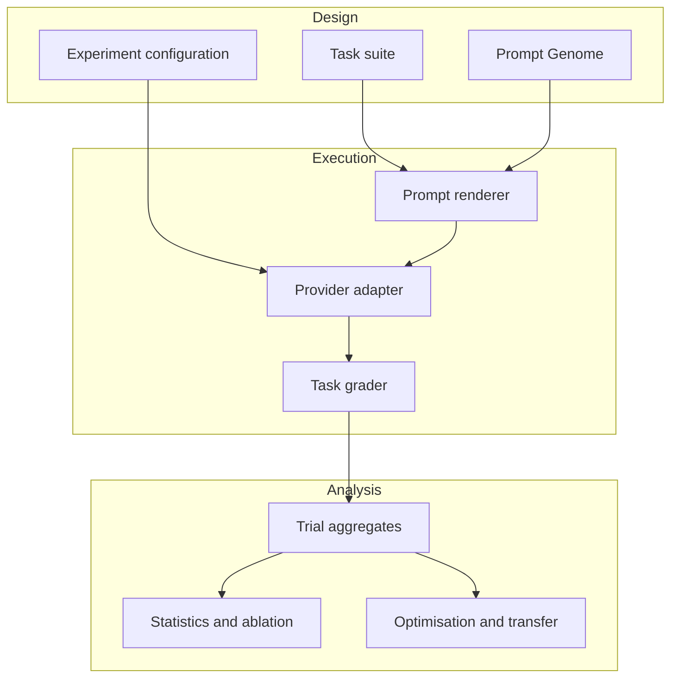

# Architecture

## Boundaries

The core package has no dependency on a provider SDK, dataframe library or dashboard framework. Provider and visualisation dependencies are optional. This keeps deterministic CI fast while allowing live extensions.

| Module | Responsibility |
|---|---|
| `genome.py` | Compose, render, fingerprint and mutate prompt architectures |
| `providers.py` | Normalise synthetic and external model calls |
| `graders.py` | Score task-specific outputs deterministically |
| `experiment.py` | Execute the complete factorial trial grid and aggregate results |
| `analysis.py` | Bootstrap, ablation, Pareto, transfer and successive-halving analysis |
| `robustness.py` | Produce deterministic holdout stress transformations |
| `reporting.py` | Generate exact Markdown and SVG evidence |
| `cli.py` | Inspect prompt variants and explicitly launch live runs |

The provider protocol makes local, hosted and future models interchangeable without changing the experimental design.

